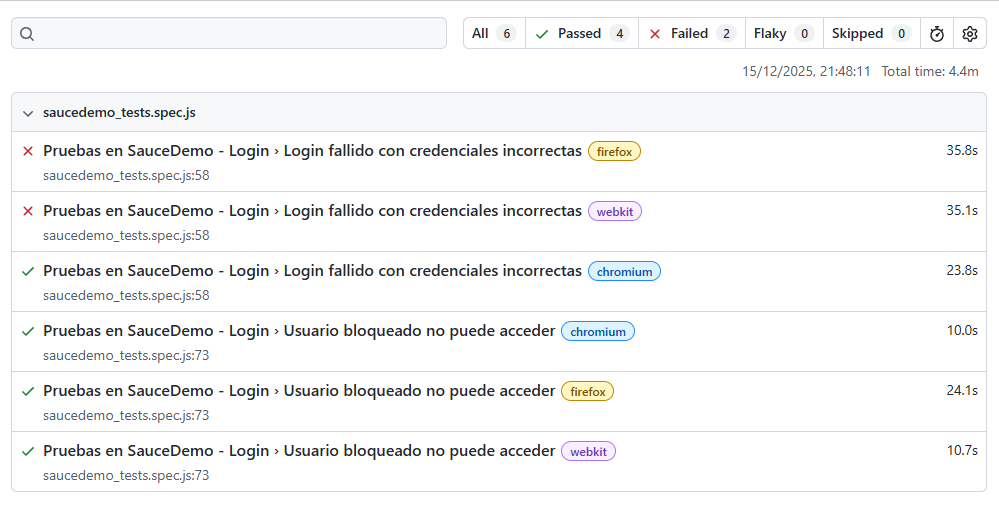
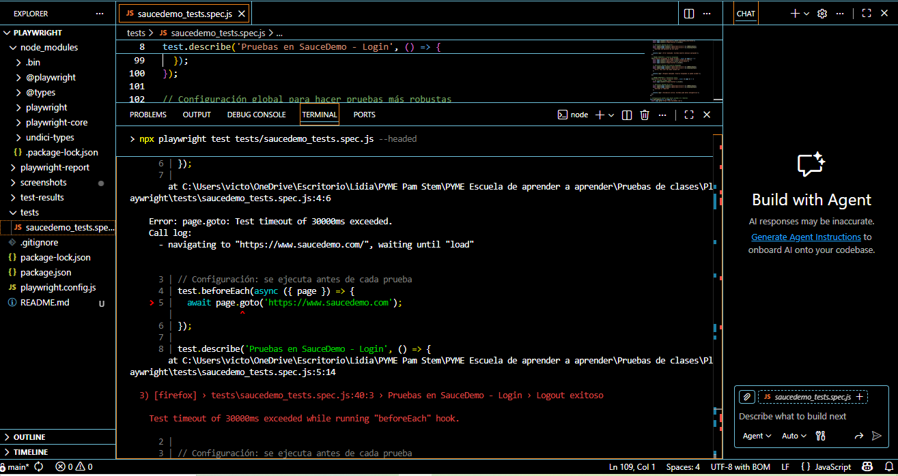

# 🧪 Proyecto Educativo: Pruebas Automatizadas con Playwright

> **Nota importante:** Este repositorio tiene un **fin educativo y de apoyo** para mostrar cómo se ve un proyecto real de pruebas automatizadas después de completar los tests con Playwright.

## 🎯 Propósito Educativo

Este proyecto sirve como **ejemplo visual y práctico** de cómo se estructura un proyecto de testing automatizado completo. Al explorar los archivos de prueba, podrás ver:

- ✅ Cómo se escribe código de pruebas real
- ✅ Cómo se organizan las pruebas positivas y negativas
- ✅ Cómo se verifican los resultados
- ✅ Cómo se configuran los archivos necesarios

## 🔍 ¿Cómo aprender de este repositorio?

1. **Ve directamente a los códigos de prueba:**
   - [`tests/saucedemo_tests.spec.js`](tests/saucedemo_tests.spec.js) - Aquí encontrarás 6 pruebas completas
   
2. **Lee los comentarios en el código:** Cada prueba incluye explicaciones educativas que muestran **cómo se va comprendiendo el test paso a paso**.

3. **Explora la estructura:** Revisa todos los archivos para entender qué se necesita para un proyecto de testing.

## 📊 Reporte Visual de Pruebas - Enfoque QA Automation

Como profesional de QA Automation, no solo ejecuto pruebas, sino que también **documento y comunico resultados de manera visual**. Aquí muestro cómo presento los reportes de mis pruebas automatizadas:

### 🖼️ Evidencia Visual de Ejecución

**1. Reporte General de Playwright**

*Este reporte muestra el resumen completo de 18 pruebas ejecutadas, con 14 exitosas y 4 que requieren ajuste. Como QA, es crucial mostrar tanto los éxitos como las áreas de mejora.*

**2. Detalle de Pruebas Específicas**

*Aquí se visualizan pruebas individuales con sus pasos, tiempos de ejecución y estado. Esta trazabilidad es esencial para debugging y para demostrar cobertura de testing.*

### 🎯 Por qué esta documentación visual es importante:

| Aspecto QA | Valor |
|------------|-------|
| **Transparencia** | Muestra resultados reales, no solo teóricos |
| **Trazabilidad** | Cada prueba puede seguirse paso a paso |
| **Comunicación** | Facilita explicar resultados a no-técnicos |
| **Profesionalismo** | Demuestra metodología estructurada |

### 📁 Estructura de evidencias en este proyecto:
playwright-saucedemo-tests/
├── screenshots/ # ← Carpeta de evidencias visuales
│ ├── playwright-report-general.png
│ └── playwright-test-details.png
├── test-results/ # Evidencias automáticas de Playwright
├── playwright-report/ # Reporte HTML completo
└── tests/ # Código de pruebas

### 🔍 Cómo replicar este enfoque en tus proyectos:
   ```bash
1. **Ejecuta pruebas con reporte HTML:**
   
   npx playwright test --reporter=html
   
2. Toma screenshots del reporte en http://localhost:9323

3. Organiza las imágenes en una carpeta screenshots/

4. Documenta qué muestra cada imagen y por qué es relevante
   ```
💡 Insight de QA: Un buen reporte no solo dice "pasó/falló", sino que cuenta la historia del testing - qué se probó, cómo se probó y qué se aprendió en el proceso.

## 📚 Pasos completos de instalación y aprendizaje

Para aprender **desde cero** cómo crear un proyecto como este, visita el repositorio educativo completo:

### 🚀 **[QA Automation Educación Inteligente](https://github.com/qalidiarodriguez/QA-AUTOMATION-EDUCACION-INTELIGENTE/tree/main/%F0%9F%9B%A0%EF%B8%8F%20HERRAMIENTAS/Playwright)**

Allí encontrarás:
- 📖 Instrucciones paso a paso para instalar Playwright
- 🎯 Ejemplos detallados de configuración
- 🧩 Ejercicios prácticos
- 🎓 Explicaciones educativas para cada concepto

## 🧪 Pruebas Incluidas en este Proyecto

### ✅ Pruebas Positivas (Flujos exitosos)
1. **Login exitoso** - Acceso con credenciales válidas
2. **Agregar producto al carrito** - Simulación de compra
3. **Logout exitoso** - Cierre de sesión correcto

### ⚠️ Pruebas Negativas (Manejo de errores)
4. **Login con credenciales incorrectas**
5. **Usuario bloqueado** 
6. **Formulario vacío**

## 🛠️ Tecnologías Utilizadas
- **Playwright** - Framework de automatización
- **JavaScript/Node.js** - Lenguaje de programación
- **GitHub** - Control de versiones y hosting

## 📊 Resultados Actuales
- **Total de pruebas:** 18
- **Pruebas exitosas:** 14 (78%)
- **Pruebas por ajustar:** 4 (en proceso de aprendizaje)

## 🚀 Cómo Ejecutar este Proyecto
```bash
# 1. Clonar el repositorio
git clone https://github.com/qalidiarodriguez/playwright-saucedemo-tests.git
# 2. Instalar dependencias
npm install
# 3. Instalar navegadores de Playwright
npx playwright install
# 4. Ejecutar pruebas
npx playwright test --headed
```

## 📖 Para Aprender Más
Este proyecto es parte de un proceso educativo continuo. Si estás comenzando en automatización de pruebas, te recomiendo:

Seguir los tutoriales en el repositorio educativo mencionado arriba

Leer los comentarios en el código de pruebas

Experimentar modificando las pruebas

Consultar la documentación oficial de Playwright

👨‍🏫 Sobre el Enfoque Educativo
"No solo muestro código que funciona, sino que explico cómo se llega a ese código, qué se considera al escribir cada prueba, y qué errores comunes se pueden encontrar en el camino."

Objetivo: Que cualquier persona que vea este repositorio pueda entender no solo qué hace el código, sino por qué se escribió así y cómo pensar como un tester automatizador.

📌 Repositorio Educativo Completo: QA Automation Educación Inteligente - Playwright

Este proyecto es de código abierto con fines educativos. ¡Aprende, experimenta y comparte!

